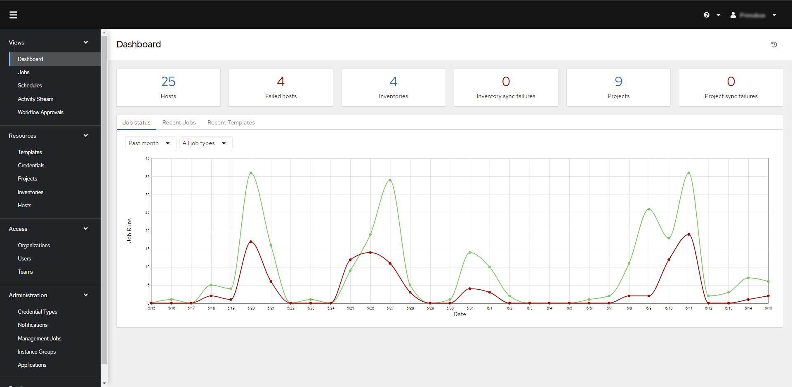

<a name="readme-top"></a>

<!-- PROJECT LOGO -->
<br />
<div align="center">
  <a href="https://github.com/lucasolerr/awx-ansible">
    
  </a>

<h3 align="center">AWX Ansible</h3>

  <p align="center">
    Dans le cadre d'un stage de deuxième année de classe préparatoire de mon école d'ingénieur, j'ai eu l'occasion d'apprendre à maîtriser des outils d'automatisation de matériel informatique comme <b>Ansible</b>. Ma mission a été de construire des scripts permettant le pilotage, la configuration, la sauvegarde et mise à jour firmware de switchs de la marque ARUBA filliale d'HP.
    <br />
  </p>
</div>


<!-- TABLE OF CONTENTS -->
<details>
  <summary>Table of Contents</summary>
  <ol>
    <li>
      <a href="#about-the-project">About The Project</a>
      <ul>
        <li><a href="#ansible">Ansible qu'est ce que c'est ?</a></li>
        <li><a href="#awx-qu-est-ce-que-c-est-?">AWX qu'est-ce que c'est ?</a></li>
      </ul>
    </li>
    <li>
      <a href="#getting-started">Getting Started</a>
      <ul>
        <li><a href="#prerequisites">Prerequisites</a></li>
        <li><a href="#installation">Installation</a></li>
      </ul>
    </li>
    <li><a href="#usage">Usage</a></li>
    <li><a href="#license">License</a></li>
    <li><a href="#contact">Contact</a></li>
    <li><a href="#acknowledgments">Acknowledgments</a></li>
  </ol>
</details>


<!-- ABOUT THE PROJECT -->
## About The Project

[](https://github.com/ansible/awx)

### Ansible qu'est ce que c'est ?

Ansible est un outil Open Source d'automatisation informatique qui automatise le provisionnement, la gestion des configurations, le déploiement des applications, l'orchestration et bien d'autres processus informatiques manuels. Ansible se connecte au système que l'on souhaite automatiser et lance des programmes chargés d'exécuter des instructions qui devraient sinon être exécutées manuellement. Ces programmes utilisent des **modules** Ansible conçus pour répondre aux attentes spécifiques du point de terminaison en matière de connectivité, d'interface et de commandes. Ansible exécute ensuite ces modules (via une connexion SSH standard par défaut). Un **playbook** Ansible est un modèle de tâches d’automatisation, qui sont des opérations informatiques complexes exécutées sans intervention humaine. Les **playbooks** Ansible sont écrits au format **YAML** lisible par l'homme et exécutés sur un ensemble, un groupe ou une classification **d'hôtes**, qui forment ensemble un **inventaire**.

### AWX qu'est-ce que c'est ?

AWX est un produit conçu par RedHat, gratuit et Open Source. Nous pouvons le définir comme un orchestrateur de **projet** et **playbook** Ansible. AWX est une interface homme machine mettant à disposition un suivi complet de nos **jobs** Ansible.

<p align="right">(<a href="#readme-top">back to top</a>)</p>

<!-- GETTING STARTED -->
## Getting Started

### Prerequisites

Pour mettre en place un système Linux nous avons besoin d'un serveur. Nous allons installer dessus un système d'exploitation Linux. Dans notre cas, nous avons choisi Rocky Linux 9, une Red Hat qui est une distribution Linux gratuite et open-source pour entreprise. 
Cette machine a besoin de faire partie du réseau de l'entreprise il faut donc lui attribuer une ip... Nous pouvons désormais accéder à distance à la machine via le protocole SSH. **SSH qu'est-ce que c'est ?** SSH signifie "secure shell", est un protocole qui facilite les connexions sécurisées entre deux systèmes, ce protocole permet de communiquer à distance avec une machine de manière sécurisée. Pour se connecter à une machine on utilise la commande suivante :

```shell
ssh user@ip-server 
```

L'objectif est d'installer Ansible sur cette machine pour pouvoir contrôler les switchs à distances. Pour cela quelques prérequis sont nécessaires. Il faut vérifier que "Python" soit installé sur la machine, ensuite il faut installer un gestionnaire de paquet sur la machine pour gérer les dépendances de python. 
Pour vérifier que python est bien installé :

```shell
python --version
```

### Installation

#### Installation d'Ansible et tous les outils nécéssaires

Nous avons choisi d'installer **pip** qui est le gestionnaire de paquet par *défaut* pour Python.

```shell
dnf install pip
```

Grâce à pip nous allons pouvoir installer *"virtualenv"* cet outil permet de travailler dans des environnements de travail virtuels. Cela permet ainsi de **cloisonner** l’installation et l’exécution d’Ansible. Ceci permettra de gérer les dépendances avec la version de Python et d’installer une version particulière de Ansible.

```shell
pip install virtualenv
```

Nous pouvons désormais créer l'environnement virtuel "ansible" dans lequel nous installerons ansible et ses dépendances avec la commande :

```shell
virtualenv ansible
```

Pour activer l'environnement virtuel, c'est à dire "entrer" dans l'environnement on utilise la commande :

```shell
source ansible/bin/activate
```

Une fois dans l'environnement virtuel, l'installation d'Ansible peut commencer.

```shell
pip install ansible
```

Nous pouvons vérifier l'installation/la version d'Ansible avec la commande :

```shell
ansible --version
python3 -m pip show ansible
```
Nous avons désormais sur notre serveur linux la plate-forme Ansible prête à être utilisée.
Pour mettre à jour les switchs à distances il faut que les switchs puissent télécharger la nouvelle image depuis un serveur distant. Pour cela nous pouvons utiliser différents protocoles tel que TFTP ou http selon le modèle du switch (TFTP pour les séries 2000x et HTTP pour les séries 6000x) :

Pour le protocole TFTP, on installe sur le serveur le paquet tftp-server et on le configure :

```shell
sudo dnf install tftp-server -y
 
sudo cp -v /usr/lib/systemd/system/tftp.service /etc/systemd/system/tftp-server.service 

sudo cp -v /usr/lib/systemd/system/tftp.socket/etc/systemd/system/tftp-server.socket 
```

On doit modifier les paramètres de certains fichiers: Change Requires=tftp.socket to Requires=tftp-server.socket, change ExecStart=/usr/sbin/in.tftpd -s /var/lib/tftpboot to ExecStart=/usr/sbin/in.tftpd -c -p -s /var/lib/tftpboot and change Also=tftp.socket to Also=tftp-server.socket. You have to add a new line BindIPv6Only=both after the ListenDatagram=69 line.

```shell
sudo vi /etc/systemd/system/tftp-server.service 
sudo vi /etc/systemd/system/tftp-server.socket 
```

```shell
sudo systemctl start tftp-server.service 
sudo systemctl enable tftp-server.service 
sudo setsebool -P tftp_anon_write 1 
sudo chmod 777 /var/lib/tftpboot 
sudo firewall-cmd --add-service=tftp --permanent 
sudo firewall-cmd –reload
```

Pour un serveur HTTP désormais, nous allons utiliser un BasicHTTPServer fourni par python.

```shell
sudo firewall-cmd --add-port=8000/tcp 
cd Downloads/ 
python -m http.server 8000
```

On a désormais un serveur HTTP et un serveur TFTP qui tournent sur notre serveur, les fichiers pouvant être téléchargés se trouvent dans /Downloads pour le serveur HTTP et /var/lib/tftpboot pour le serveur TFTP.

#### Installation de l'interface graphique AWX

Installer préalablement [minikube](https://minikube.sigs.k8s.io/docs/start/) et [kubectl](https://kubernetes.io/docs/tasks/tools/install-kubectl-linux/) puis démarrage de l’installation d’AWX :

On crée d’abord le cluster minikube avec les ressources nécessaires :

```shell
minikube start --cpus=4 --memory=6g --addons=ingress
minikube kubectl -- get pods -A
```

Si certains pods sont en erreurs ou ne se créent pas il faut vérifier que les images qu’ils téléchargent s’installent bien avec la commande :

```shell
kubectl describe pods <nom du pods>
```

Si un pods est en train de télécharger une image, vous pouvez forcer l’installation en copiant l’adresse de téléchargement puis en se connectant dans le cluster avec la commande :

```shell
minikube ssh
```

Puis en téléchargeant l’image depuis l’url copié :

```shell
docker pull <url-de-l’image>
```

Créer un fichier nommé kustomization.yaml contenant :

```file
apiVersion: kustomize.config.k8s.io/v1beta1
kind: Kustomization
resources:
  # Find the latest tag here: https://github.com/ansible/awx-operator/releases
  - github.com/ansible/awx-operator/config/default?ref=<tag>

# Set the image tags to match the git version from above
images:
  - name: quay.io/ansible/awx-operator
    newTag: <tag>

# Specify a custom namespace in which to install AWX
namespace: awx
```

On peut désormais lancer l’installation des images.

```shell
kustomize build . | kubectl apply -f –
```

Il est important de vérifier que le conteneur awx-operator soit en marche.

```shell
kubectl get pods -n awx
```

Pour ne pas avoir à répéter le nom du namespace à chaque fois, on peut définir le namespace que l’on veut interroger avec la commande :

```shell
kubectl config set-context --current --namespace=awx
```

Ensuite, créer un fichier nommé awx-demo.yaml dans le même répertoire contenant :

```shell
---
apiVersion: awx.ansible.com/v1beta1
kind: AWX
metadata:
  name: awx-demo
spec:
  service_type: nodeport
  ingress_type: none
  hostname: awx-demo.example.com
```
On peut désormais lancer l’installation des images.

```shell
kustomize build . | kubectl apply -f –
kubectl logs -f deployments/awx-operator-controller-manager -c awx-manager
kubectl get svc -l "app.kubernetes.io/managed-by=awx-operator"
kubectl get secret awx-demo-admin-password -o jsonpath="{.data.password}" | base64 --decode
```
Comment accéder à l'interface AWX ?

Actuellement, AWX est hébergé sur un serveur tournant sous Rocky Linux 9. Le principe de fonctionnement d'AWX se repose sur la **conteneurisation**. La **conteneurisation** consiste à rassembler le code du logiciel et tous ses composants (bibliothèques, frameworks et autres dépendances) de manière à les **isoler** dans leur propre *« conteneur »*. Le conteneur fonctionne comme une sorte de bulle, ou comme un environnement de calcul qui enveloppe l'application et l'isole de son entourage. Nous avons fait le choix d'utiliser *Kubernetes* qui est une plateforme Open Source d'orchestration des conteneurs qui facilite la gestion des applications distribuées et conteneurisées à grande échelle. Plus particulièrement nous avons utilisé **minikube**, un outil facilitant l’exécution locale de Kubernetes. AWX n'est ainsi pas exposable sur le réseau de l'entreprise mais seulement à l'intérieur de la machine hôte, dans notre cas le serveur Linux. Ce serveur se trouve à l'adresse x.x.x.x. Pour accéder à l'IHM d'AWX depuis votre ordinateur distant il faut établir une redirection de port entre le serveur et son conteneur AWX, le port dédié est le 7080. Ainsi en se connectant en ssh sur le serveur linux avec une redirection de port sur notre machine locale, nous pouvons enfin accéder à l'IHM AWX.

```shell
ssh -L 7080:localhost:7080 user-ansible@x.x.x.x
```

Il n'y plus qu'à accéder à l'adresse http://localhost:7080/#/login

<p align="right">(<a href="#readme-top">back to top</a>)</p>

<!-- USAGE EXAMPLES -->
## Usage

### AWX comment ça marche ?

On arrive tout d'abord sur le Dashboard, un panneau d'information générale du suivi de nos hôtes, nos inventaires et nos projets.

### Projet

De manière générale, un projet Ansible contient l’ensemble des **playbooks** nécessaires à notre projet, mais également un **inventaire** qui englobe les machines ciblées par nos playbook, ou encore des modules créés par la communauté Ansible nommés _“Collections”_ ou _“Roles”_. Dans notre cas, les machines ciblées sont des switchs de la marque Aruba, nous faisons ainsi appel à des collections développées par Aruba pour interagir plus facilement avec les switchs. Plusieurs possibilités sont offertes quant à la localisation des projets. Il est possible de localiser les projets directement sur la machine host d’AWX (par défaut dans /var/lib/awx/projects), mais il est également possible de passer par le système de Red Hat “Insights” ou encore directement par un repository comme Github ou GitLab. Nous avons fait le choix d'héberger le projet sur Github à l'adresse https://github.com/lucasolerr/awx-ansible
Pour chaque inventaire, il y a la possibilité de subdivisé les hosts en groupe. La configuration de l'inventaire au niveau de l'entreprise sera détaillée ci-dessous.

### Template

Les templates AWX sont simplement des launchers pour playbooks. C'est ici que tous les playbooks sont instanciés, et c'est ici que nous pouvons les exécuter.
Le détail de tous les playbook disponible au sein d'un tableau récapitulatif est disponible en Annexe.

En lançant un Template grâce à l’icône de fusée, les commandes contenues dans le playbook vont s’exécuter sur l’Host désiré. Il faut choisir soit via _Other Prompts_ de rentrer l’ip d’un host en particulier pour exécuter une action sur un host unique. Ou alors grâce au _Survey_ entrer le nom du **groupe d’host** ciblé (France, Centre-Est, …). Puis dans la _Preview_ bien vérifier le ou les hosts ciblé(s).

### Comment ajouter un host ?

En tant qu'admin, se rendre dans l'onglet "Resources/Inventories", Sélectionner l'inventaire souhaité. Dans le panneau Hosts cliquer sur Add, dans Name entrer le nom de l'host.

Dans l'onglet Variables, il faut inscrire :
- ansible_host : adresse ip de l'host
- ansible_user : nom d'utilisateur pour se connecter à l'host en ssh
- ansible_password : mot de passe pour se connecter à l'host en ssh
- ansible_network_os : os de l'host se référer à l'annexe pour le détail de l'os selon le modèle de switch

Concernant le mot de passe de l’hôte il y a la possibilité de le stocker d’une manière sécurisée grâce à Ansible-vault.
Tout d’abord il faut entrer comme password dans l’interface d’AWX le nom d’une variable par exemple : ansible_password : “{{ new_host_password }}“

Sur la machine hôte d’Ansible, il faut récupérer l’ancien fichier contenant tous les mots de passes le décrypter à l’aide de la commande :

```shell
ansible-vault decrypt vault.yml
```

Modifier le fichier en y ajoutant le nouveau mot de passe après le nom de la variable choisi sur AWX. Dans notre cas cela donnerait :

```
new_host_password: secure_pw
```

Il faut ensuite réencrypter le fichier de mot de passe avec le mot de passe maître vault avec la commande :

```
ansible-vault encrypt vault.yml
```

Il ne reste plus qu’à push le contenu du fichier “vault.yml“ sur le répertoire de code et tous les mots de passes sont protégés.
Dans chaque template il faut s’assurer que les identifiants vault sont bien saisis.

Sinon il faut les ajouter en modifiant les paramètres du template et en ajoutant comme *« Creditentials »*, comme *« Vault »* l’identifiant *« Vault Password »*. Cet identifiant est le mot de passe permettant à AWX de décrypter le fichier contenant tous les mots de passes d’accès aux hôtes.

Pour ajouter un nouvel identifiant le cas échéant il faut se rendre dans Resources/Creditentials puis Add. *"Type Vault"* et rentrer dans le champ password le vault password permettant d’encrypter et de décrypter les fichiers.

### Comment ajouter un utilisateur ?

En tant qu'admin, se rendre dans l'onglet "Access/Users", cliquer sur Add.
Puis entrer les informations du nouvel utilisateur, lui affecter l'organisation Entreprise et les droits Normal User.

### Comment créer une équipe ?

En tant qu'admin, se rendre dans l'onglet "Access/Teams", cliquer sur Add.
Puis entrer les informations de la nouvelle équipe et lui affecter l'organisation Entreprise.

### Comment affecter un utilisateur à une équipe ?

Cliquer sur l'équipe désirée dans l'onglet "Acess/Teams" puis se rendre dans le panneau Access.
Cliquer sur Add, sélectionner Users puis Next. Chercher ensuite l'utilisateur dans la liste et le sélectionner.
Sélectionner ensuite le rôle de l'utilisateur au sein de l'équipe.

### Comment donner l'accès à un template à une équipe ?

En tant qu'admin, se rendre dans l'onglet "Resources/Template", cliquer sur le template désiré. Dans le panneau Access, cliquer sur Add puis sélectionner Teams, Next. Chercher ensuite l'équipe dans la liste et la sélectionner.
Sélectionner ensuite le rôle applicable à l'équipe.

### Comment ajouter la possibilité de se faire notifier lors de l'exécution d'un playbook ?

En tant qu'admin, se rendre dans l'onglet "Administration/Notifications", cliquer sur Add. Entrer un nom de notification, attribuer la notification à l'organisation Entreprise puis choisir le type de notification. Vous avez le choix entre :

- E-mail
- Grafana
- IRC
- Mattermost
- Pagerduty
- Rocket.Chat
- Slack
- Twilio
- Webhook

Ajouter une notification mail :

Pour ajouter une notification mail, il suffit de sélectionner le champ E-mail sur AWX et rentrer les informations nécessaires à savoir :
- User : prenom.nom@Entreprise.fr
- Password : mot de passe attribué à votre compte office
- Host : smtp.office365.com
- Recipient list : Liste de destinataires de la notification
- Sender e-mail : E-mail de provenance de la notification
- Port : 587
- Email options : Use TLS

### Comment planifier l'exécution ou répéter l'exécution d'un playbook ?

En tant qu'admin, se rendre dans l'onglet "Resources/Templates", cliquer sur le template à programmer. Dans le panneau Schedules cliquer sur Add. Entrer un nom, une description la date et l'heure de commencement puis si désiré la fréquence de répétions en minutes/heures/jours/semaines/mois. Puis Sauvegarder.

### Liste de destination des scripts sur le serveur

Les fichiers de scripts sont présents dans le dossier /home/user-ansible/scripts.
Les fichiers de logs seront téléchargés dans /home/user-ansible/logs/{{ nom_de_l’host }}.cfg
Le fichier d’inventaire du parc réseau sera lui dans /home/user-ansible/files/inventaire.xlsx
Les fichiers de configuration des switchs seront quant à eux dans /home/user-ansible/cfg/daily/…

### Comment utiliser les scripts de requête API pour alimenter un inventaire depuis un fichier csv 

En exportant le .csv depuis Aruba Central listant toutes les machines présentes sur le réseau on obtient un fichier comme ceci :

```
"DEVICE NAME,""TYPE"",""CLIENTS"",""ALERTS"",""MODEL"",""CONFIG STATUS"",""LAST SEEN"",""USAGE"",""IP ADDRESS"",""MAC"",""FIRMWARE VERSION"",""NAE AGGREGATE STATUS"",""GROUP"",""LABELS"",""SITE"",""UPTIME"",""SERIAL"",""UPLINK PORTS"",""PORT UTILIZATION"""
"Aruba-2540-48G-PoEP-4SFPP,""AOS-S"",""0"",""0"",""Aruba2540-48G-PoE+-4SFP+ Switch(JL357A)"",""Not in sync (Commit pending)"","""",""0 bps"",""x.x.x.x.x"",""x:x:x:x:x:x"",""x.x.x"","""","""","""","""",""-"","""","""",""0%"""
```

C’est un fichier csv contenant de nombreuses informations sur un switch. Depuis ce fichier à l’aide d’un script python nous allons pouvoir récupérer les informations qui nous intéressent à savoir l’adresse ip et le modèle du switch pour l’ajouter à nos inventaires AWX.

Le script de la ligne 1 à 23 s’occupe de rendre le fichier csv lisible en enlevant les artefacts et les mauvaises notations du fichier.
Ensuite est défini l’url de la rêquete API on y reconnaît l’adresse ip de l’interface AWX, une requête sur l’api qui concerne l’inventaire d’id 7. Cette id correspond à l’inventaire ciblé ici le "7" correspond à l’inventaire nommé Entreprise, il suffit de changer "7" par l’id d’un autre inventaire pour ajouter les hôtes du fichier csv dans un autre inventaire.
Par la suite le script s’occupe de récupérer les informations d’adresse ip et de modèle puis requête l’api host par host pour les ajouter à l’inventaire avec comme hostname leur adresse ip (aucune donnée n’est présente dans le csv pour les nommer par exemple X-X-X)

### Script de requête API pour ajouter des hôtes dans des groupes dédiés depuis un fichier csv 

Il y a un deuxième script permettant d’ajouter les hôtes à l’inventaire et de les instancier directement dans un groupe. Ce groupe est défini par le label *"SITE"* dans le fichier csv. Le script va récupérer le contenu de cette colonne va ajouter ce groupe à l’inventaire d’id choisi puis va ajouter tous les hôtes du fichier csv au groupe correspondant au *"SITE"* renseigné dans le fichier csv pour l’hôte correspondant.
Il faut faire attention qu’aucun groupe possédant le même nom existe déjà ou qu’aucun hôte possédant le même nom préexiste. Sinon le script renverra une erreur.


<p align="right">(<a href="#readme-top">back to top</a>)</p>

<!-- CONTACT -->
## Contact

Luca SOLER - [@Luca_SOLER](https://twitter.com/twitter_handle) - contact@lucasoler.fr

Project Link: [https://github.com/lucasolerr/awx-ansible](https://github.com/lucasolerr/awx-ansible)

<p align="right">(<a href="#readme-top">back to top</a>)</p>


[product-screenshot]: images/screenshot.png
